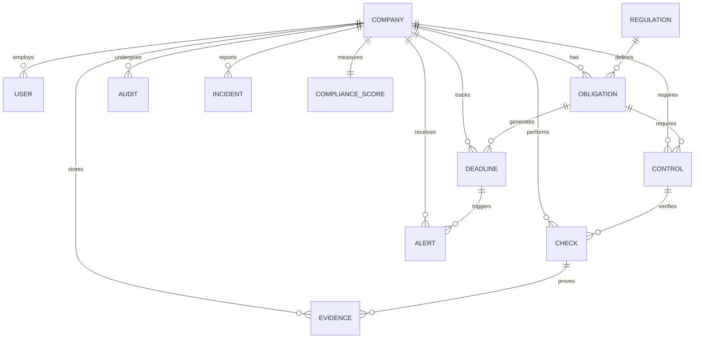

# 🗂️ Data Model V2 - Compliance Engine
## Enterprise-Grade Compliance Data Architecture

> [!IMPORTANT]
> This data model transforms the system from a "deadline tracker" to a true **compliance engine** with audit readiness, evidence tracking, and risk scoring capabilities.

---

## Key Architectural Principle

**Every entity MUST include `companyId`** for multi-tenant SaaS isolation.

---

## 1. Core Entity Flow

```
REGULATION
   ↓
OBLIGATION (what must be done legally)
   ↓
CONTROL (what must exist to satisfy it) ⭐ NEW
   ↓
CHECK (verification event) ⭐ NEW
   ↓
EVIDENCE (proof files) ⭐ NEW
   ↓
DEADLINE (time-bound requirement)
   ↓
ALERT (notification to users)
```

---

## 2. Entity Definitions

### 🏢 COMPANY

**Purpose**: Legal entity being audited (multi-tenant root)

```typescript
interface Company {
  id: string;                    // UUID
  
  legalName: string;             // "SportWear Tunisia SARL"
  tradeName?: string;            // DBA
  
  taxId: string;                 // Matricule fiscal (unique)
  cnssId?: string;               // CNSS identifier
  
  activitySector: SectorEnum;    // TEXTILE_SPORT, TEXTILE_FASHION, etc.
  companySize: SizeEnum;         // MICRO, SMALL, MEDIUM
  
  address?: string;
  phone?: string;
  email?: string;
  
  isActive: boolean;
  
  createdAt: Date;
  updatedAt: Date;
}
```

**Enums**:
```typescript
enum SectorEnum {
  TEXTILE_SPORT = 'TEXTILE_SPORT',
  TEXTILE_FASHION = 'TEXTILE_FASHION',
  TEXTILE_HOME = 'TEXTILE_HOME',
  FOOD = 'FOOD',
  ELECTRONICS = 'ELECTRONICS',
  OTHER = 'OTHER'
}

enum SizeEnum {
  MICRO = 'MICRO',        // < 10 employees
  SMALL = 'SMALL',        // 10-49
  MEDIUM = 'MEDIUM',      // 50-250
  LARGE = 'LARGE'         // > 250
}
```

---

### 👤 USER

**Purpose**: Human actors with role-based permissions

```typescript
interface User {
  id: string;
  companyId: string;             // 🔐 Multi-tenant boundary
  
  name: string;
  email: string;                 // Must be unique
  
  role: UserRole;
  
  passwordHash: string;
  
  isActive: boolean;
  lastLoginAt?: Date;
  
  createdAt: Date;
}
```

**Roles**:
```typescript
enum UserRole {
  COMPANY_ADMIN = 'COMPANY_ADMIN',           // Full access
  COMPLIANCE_OFFICER = 'COMPLIANCE_OFFICER', // Manage compliance
  EMPLOYEE = 'EMPLOYEE',                     // Limited view
  AUDITOR = 'AUDITOR'                        // Read-only external
}
```

---

### 📜 REGULATION

**Purpose**: Source of legal authority

```typescript
interface Regulation {
  id: string;
  
  code: string;                  // "Code Travail Art. 152-155"
  title: string;                 // "Médecine du travail"
  
  authority: AuthorityEnum;      // CNSS, ANPE, DGI, etc.
  category: CategoryEnum;        // FISCAL, SOCIAL, HSE, etc.
  
  description: text;
  sectorScope?: string;          // "Textile", "All", etc.
  
  effectiveDate: Date;
  expirationDate?: Date;
  
  jortReference?: string;        // Official gazette ref
  
  createdAt: Date;
}
```

**Enums**:
```typescript
enum AuthorityEnum {
  DGI = 'DGI',
  CNSS = 'CNSS',
  CNAM = 'CNAM',
  ANPE = 'ANPE',
  ANGED = 'ANGED',
  ONAS = 'ONAS',
  INPDP = 'INPDP',
  PROTECTION_CIVILE = 'PROTECTION_CIVILE',
  INSPECTION_TRAVAIL = 'INSPECTION_TRAVAIL',
  DOUANE = 'DOUANE',
  OTHER = 'OTHER'
}

enum CategoryEnum {
  FISCAL = 'FISCAL',
  SOCIAL = 'SOCIAL',
  HSE = 'HSE',
  ENVIRONMENTAL = 'ENVIRONMENTAL',
  QUALITY = 'QUALITY',
  BRAND_AUDIT = 'BRAND_AUDIT',
  CUSTOMS = 'CUSTOMS',
  DATA_PROTECTION = 'DATA_PROTECTION',
  INSURANCE = 'INSURANCE',
  LABOR = 'LABOR',
  OTHER = 'OTHER'
}
```

---

### 📌 OBLIGATION

**Purpose**: What a company must legally do

```typescript
interface Obligation {
  id: string;
  companyId: string;             // 🔐 Multi-tenant
  regulationId: string;          // FK to REGULATION
  
  title: string;                 // "Monthly CNSS declaration"
  description: text;
  
  frequency: FrequencyEnum;
  riskLevel: RiskLevelEnum;
  
  isActive: boolean;
  applicableSectors?: string[];  // null = all sectors
  
  createdAt: Date;
  updatedAt: Date;
}
```

**Enums**:
```typescript
enum FrequencyEnum {
  MONTHLY = 'MONTHLY',
  QUARTERLY = 'QUARTERLY',
  ANNUAL = 'ANNUAL',
  BIENNIAL = 'BIENNIAL',
  EVENT_BASED = 'EVENT_BASED',
  CONTINUOUS = 'CONTINUOUS'
}

enum RiskLevelEnum {
  LOW = 'LOW',
  MEDIUM = 'MEDIUM',
  HIGH = 'HIGH',
  CRITICAL = 'CRITICAL'
}
```

---

### 🧩 CONTROL ⭐ NEW

**Purpose**: Concrete requirement that must exist to satisfy an obligation

**Example**: 
- Obligation: "Fire safety compliance"
- Controls: "Fire extinguishers", "Evacuation plan", "Emergency lighting"

```typescript
interface Control {
  id: string;
  companyId: string;             // 🔐 Multi-tenant
  obligationId: string;          // FK to OBLIGATION
  
  controlType: ControlTypeEnum;
  description: string;           // "Maintain valid fire extinguishers"
  
  isMandatory: boolean;          // vs recommended
  
  metadata?: {
    quantity?: number;           // "5 extinguishers"
    location?: string;           // "Production floor A"
    validityPeriod?: number;     // months
  };
  
  createdAt: Date;
  updatedAt: Date;
}
```

**Enums**:
```typescript
enum ControlTypeEnum {
  DOCUMENT = 'DOCUMENT',         // Certificate, permit, registration
  PROCESS = 'PROCESS',           // Procedure, workflow
  EQUIPMENT = 'EQUIPMENT',       // Physical items
  TRAINING = 'TRAINING',         // Personnel certification
  PERMIT = 'PERMIT',             // License, authorization
  INSPECTION = 'INSPECTION'      // Periodic verification
}
```

---

### 🔎 CHECK (Inspection/Verification) ⭐ NEW

**Purpose**: Record of a compliance verification event

```typescript
interface Check {
  id: string;
  companyId: string;             // 🔐 Multi-tenant
  controlId: string;             // FK to CONTROL
  
  checkedBy: string;             // User ID or external auditor
  checkedByName: string;         // Name for display
  checkDate: Date;
  
  status: CheckStatusEnum;
  
  notes?: text;                  // Inspector comments
  findings?: text;               // Issues discovered
  
  nextCheckDue?: Date;           // If periodic
  
  createdAt: Date;
  updatedAt: Date;
}
```

**Enums**:
```typescript
enum CheckStatusEnum {
  COMPLIANT = 'COMPLIANT',
  NON_COMPLIANT = 'NON_COMPLIANT',
  PARTIAL = 'PARTIAL',
  NOT_APPLICABLE = 'NOT_APPLICABLE'
}
```

---

### 📎 EVIDENCE ⭐ NEW

**Purpose**: Proof files attached to checks

```typescript
interface Evidence {
  id: string;
  companyId: string;             // 🔐 Multi-tenant
  checkId: string;               // FK to CHECK
  
  fileName: string;
  filePath: string;              // Storage location
  fileType: FileTypeEnum;
  fileSize: number;              // bytes
  
  uploadedBy: string;            // User ID
  uploadedAt: Date;
  
  description?: string;
  
  createdAt: Date;
}
```

**Enums**:
```typescript
enum FileTypeEnum {
  PDF = 'PDF',
  IMAGE = 'IMAGE',
  VIDEO = 'VIDEO',
  DOCUMENT = 'DOCUMENT',         // Word, Excel
  OTHER = 'OTHER'
}
```

---

### ⏰ DEADLINE

**Purpose**: Time-bound compliance requirement

```typescript
interface Deadline {
  id: string;
  companyId: string;             // 🔐 Multi-tenant
  obligationId: string;          // FK to OBLIGATION
  
  dueDate: Date;
  status: DeadlineStatusEnum;
  
  completedDate?: Date;
  completedBy?: string;          // User ID
  
  lastReminderSent?: Date;
  reminderCount: number;
  
  notes?: text;
  
  createdAt: Date;
  updatedAt: Date;
}
```

**Enums**:
```typescript
enum DeadlineStatusEnum {
  PENDING = 'PENDING',
  COMPLETED = 'COMPLETED',
  OVERDUE = 'OVERDUE',
  CANCELLED = 'CANCELLED'
}
```

---

### 🔔 ALERT

**Purpose**: User notifications for upcoming/overdue deadlines

```typescript
interface Alert {
  id: string;
  companyId: string;             // 🔐 Multi-tenant
  deadlineId: string;            // FK to DEADLINE
  userId?: string;               // Target user (null = all company users)
  
  level: AlertLevelEnum;
  message: string;
  
  isRead: boolean;
  readAt?: Date;
  
  createdAt: Date;
}
```

**Enums**:
```typescript
enum AlertLevelEnum {
  INFO = 'INFO',                 // 30+ days
  WARNING = 'WARNING',           // 7-30 days
  CRITICAL = 'CRITICAL',         // < 7 days or overdue
  URGENT = 'URGENT'              // Overdue critical obligation
}
```

---

### 🧪 AUDIT

**Purpose**: External audit or certification event

```typescript
interface Audit {
  id: string;
  companyId: string;             // 🔐 Multi-tenant
  
  auditType: AuditTypeEnum;
  auditorName: string;           // "SGS", "Bureau Veritas"
  auditDate: Date;
  
  result: AuditResultEnum;
  score?: string;                // "A", "85%", "Green"
  
  reportPath?: string;           // Stored audit report
  expiryDate?: Date;             // Certification validity
  
  findings?: text;
  correctiveActions?: text;
  
  createdAt: Date;
  updatedAt: Date;
}
```

**Enums**:
```typescript
enum AuditTypeEnum {
  BSCI = 'BSCI',
  SMETA = 'SMETA',
  DISNEY = 'DISNEY',
  WALMART = 'WALMART',
  ISO_9001 = 'ISO_9001',
  ISO_14001 = 'ISO_14001',
  ISO_45001 = 'ISO_45001',
  OEKO_TEX = 'OEKO_TEX',
  GOTS = 'GOTS',
  ANPE = 'ANPE',
  CNSS = 'CNSS',
  FIRE_SAFETY = 'FIRE_SAFETY',
  ELECTRICAL = 'ELECTRICAL',
  OTHER = 'OTHER'
}

enum AuditResultEnum {
  PASS = 'PASS',
  FAIL = 'FAIL',
  CONDITIONAL = 'CONDITIONAL',
  PENDING = 'PENDING'
}
```

---

### ⚠️ INCIDENT (Optional but powerful)

**Purpose**: Track compliance violations or accidents

```typescript
interface Incident {
  id: string;
  companyId: string;             // 🔐 Multi-tenant
  
  incidentType: IncidentTypeEnum;
  severity: SeverityEnum;
  
  incidentDate: Date;
  location?: string;
  
  description: text;
  affectedPersons?: number;
  
  rootCause?: text;
  correctiveActions?: text;
  
  relatedObligationId?: string;  // FK (if applicable)
  
  reportedBy: string;            // User ID
  reportedAt: Date;
  
  status: IncidentStatusEnum;
  closedAt?: Date;
  
  createdAt: Date;
  updatedAt: Date;
}
```

**Enums**:
```typescript
enum IncidentTypeEnum {
  ACCIDENT = 'ACCIDENT',
  FIRE = 'FIRE',
  CHEMICAL_SPILL = 'CHEMICAL_SPILL',
  POLLUTION = 'POLLUTION',
  DATA_BREACH = 'DATA_BREACH',
  REGULATORY_VIOLATION = 'REGULATORY_VIOLATION',
  OTHER = 'OTHER'
}

enum SeverityEnum {
  MINOR = 'MINOR',
  MODERATE = 'MODERATE',
  MAJOR = 'MAJOR',
  CRITICAL = 'CRITICAL'
}

enum IncidentStatusEnum {
  OPEN = 'OPEN',
  INVESTIGATING = 'INVESTIGATING',
  RESOLVED = 'RESOLVED',
  CLOSED = 'CLOSED'
}
```

---

### 📊 COMPLIANCE_SCORE (Computed)

**Purpose**: Quantified compliance health

```typescript
interface ComplianceScore {
  id: string;
  companyId: string;             // 🔐 Multi-tenant
  
  overallScore: number;          // 0-100
  
  // Category breakdowns
  safetyScore: number;
  taxScore: number;
  socialScore: number;
  environmentalScore: number;
  
  lastCalculatedAt: Date;
  
  // Details for display
  totalControls: number;
  compliantControls: number;
  overdueDeadlines: number;
  
  createdAt: Date;
  updatedAt: Date;
}
```

---

## 3. Entity Relationships (ERD)



---

## 4. Database Tables (PostgreSQL)

### companies
```sql
CREATE TABLE companies (
  id UUID PRIMARY KEY DEFAULT gen_random_uuid(),
  legal_name TEXT NOT NULL,
  trade_name TEXT,
  tax_id TEXT NOT NULL UNIQUE,
  cnss_id TEXT,
  activity_sector TEXT NOT NULL,
  company_size TEXT NOT NULL,
  address TEXT,
  phone TEXT,
  email TEXT,
  is_active BOOLEAN DEFAULT true,
  created_at TIMESTAMPTZ DEFAULT NOW(),
  updated_at TIMESTAMPTZ DEFAULT NOW()
);
```

### users
```sql
CREATE TABLE users (
  id UUID PRIMARY KEY DEFAULT gen_random_uuid(),
  company_id UUID NOT NULL REFERENCES companies(id) ON DELETE CASCADE,
  name TEXT NOT NULL,
  email TEXT NOT NULL UNIQUE,
  role TEXT NOT NULL,
  password_hash TEXT NOT NULL,
  is_active BOOLEAN DEFAULT true,
  last_login_at TIMESTAMPTZ,
  created_at TIMESTAMPTZ DEFAULT NOW()
);

CREATE INDEX idx_users_company ON users(company_id);
CREATE INDEX idx_users_email ON users(email);
```

### regulations
```sql
CREATE TABLE regulations (
  id UUID PRIMARY KEY DEFAULT gen_random_uuid(),
  code TEXT NOT NULL,
  title TEXT NOT NULL,
  authority TEXT NOT NULL,
  category TEXT NOT NULL,
  description TEXT,
  sector_scope TEXT,
  effective_date DATE,
  expiration_date DATE,
  jort_reference TEXT,
  created_at TIMESTAMPTZ DEFAULT NOW()
);
```

### obligations
```sql
CREATE TABLE obligations (
  id UUID PRIMARY KEY DEFAULT gen_random_uuid(),
  company_id UUID NOT NULL REFERENCES companies(id) ON DELETE CASCADE,
  regulation_id UUID REFERENCES regulations(id),
  title TEXT NOT NULL,
  description TEXT,
  frequency TEXT NOT NULL,
  risk_level TEXT NOT NULL,
  is_active BOOLEAN DEFAULT true,
  applicable_sectors JSONB,
  created_at TIMESTAMPTZ DEFAULT NOW(),
  updated_at TIMESTAMPTZ DEFAULT NOW()
);

CREATE INDEX idx_obligations_company ON obligations(company_id);
```

### controls ⭐
```sql
CREATE TABLE controls (
  id UUID PRIMARY KEY DEFAULT gen_random_uuid(),
  company_id UUID NOT NULL REFERENCES companies(id) ON DELETE CASCADE,
  obligation_id UUID NOT NULL REFERENCES obligations(id) ON DELETE CASCADE,
  control_type TEXT NOT NULL,
  description TEXT NOT NULL,
  is_mandatory BOOLEAN DEFAULT true,
  metadata JSONB,
  created_at TIMESTAMPTZ DEFAULT NOW(),
  updated_at TIMESTAMPTZ DEFAULT NOW()
);

CREATE INDEX idx_controls_company ON controls(company_id);
CREATE INDEX idx_controls_obligation ON controls(obligation_id);
```

### checks ⭐
```sql
CREATE TABLE checks (
  id UUID PRIMARY KEY DEFAULT gen_random_uuid(),
  company_id UUID NOT NULL REFERENCES companies(id) ON DELETE CASCADE,
  control_id UUID NOT NULL REFERENCES controls(id) ON DELETE CASCADE,
  checked_by TEXT NOT NULL,
  checked_by_name TEXT NOT NULL,
  check_date DATE NOT NULL,
  status TEXT NOT NULL,
  notes TEXT,
  findings TEXT,
  next_check_due DATE,
  created_at TIMESTAMPTZ DEFAULT NOW(),
  updated_at TIMESTAMPTZ DEFAULT NOW()
);

CREATE INDEX idx_checks_company ON checks(company_id);
CREATE INDEX idx_checks_control ON checks(control_id);
CREATE INDEX idx_checks_date ON checks(check_date);
```

### evidence ⭐
```sql
CREATE TABLE evidence (
  id UUID PRIMARY KEY DEFAULT gen_random_uuid(),
  company_id UUID NOT NULL REFERENCES companies(id) ON DELETE CASCADE,
  check_id UUID NOT NULL REFERENCES checks(id) ON DELETE CASCADE,
  file_name TEXT NOT NULL,
  file_path TEXT NOT NULL,
  file_type TEXT NOT NULL,
  file_size INTEGER,
  uploaded_by TEXT NOT NULL,
  uploaded_at TIMESTAMPTZ DEFAULT NOW(),
  description TEXT,
  created_at TIMESTAMPTZ DEFAULT NOW()
);

CREATE INDEX idx_evidence_company ON evidence(company_id);
CREATE INDEX idx_evidence_check ON evidence(check_id);
```

### deadlines
```sql
CREATE TABLE deadlines (
  id UUID PRIMARY KEY DEFAULT gen_random_uuid(),
  company_id UUID NOT NULL REFERENCES companies(id) ON DELETE CASCADE,
  obligation_id UUID NOT NULL REFERENCES obligations(id) ON DELETE CASCADE,
  due_date DATE NOT NULL,
  status TEXT NOT NULL DEFAULT 'PENDING',
  completed_date DATE,
  completed_by TEXT,
  last_reminder_sent TIMESTAMPTZ,
  reminder_count INTEGER DEFAULT 0,
  notes TEXT,
  created_at TIMESTAMPTZ DEFAULT NOW(),
  updated_at TIMESTAMPTZ DEFAULT NOW()
);

CREATE INDEX idx_deadlines_company ON deadlines(company_id);
CREATE INDEX idx_deadlines_date ON deadlines(due_date);
CREATE INDEX idx_deadlines_status ON deadlines(status);
```

### alerts
```sql
CREATE TABLE alerts (
  id UUID PRIMARY KEY DEFAULT gen_random_uuid(),
  company_id UUID NOT NULL REFERENCES companies(id) ON DELETE CASCADE,
  deadline_id UUID NOT NULL REFERENCES deadlines(id) ON DELETE CASCADE,
  user_id UUID REFERENCES users(id),
  level TEXT NOT NULL,
  message TEXT NOT NULL,
  is_read BOOLEAN DEFAULT false,
  read_at TIMESTAMPTZ,
  created_at TIMESTAMPTZ DEFAULT NOW()
);

CREATE INDEX idx_alerts_company ON alerts(company_id);
CREATE INDEX idx_alerts_user ON alerts(user_id);
CREATE INDEX idx_alerts_unread ON alerts(is_read) WHERE is_read = false;
```

### audits
```sql
CREATE TABLE audits (
  id UUID PRIMARY KEY DEFAULT gen_random_uuid(),
  company_id UUID NOT NULL REFERENCES companies(id) ON DELETE CASCADE,
  audit_type TEXT NOT NULL,
  auditor_name TEXT NOT NULL,
  audit_date DATE NOT NULL,
  result TEXT NOT NULL,
  score TEXT,
  report_path TEXT,
  expiry_date DATE,
  findings TEXT,
  corrective_actions TEXT,
  created_at TIMESTAMPTZ DEFAULT NOW(),
  updated_at TIMESTAMPTZ DEFAULT NOW()
);

CREATE INDEX idx_audits_company ON audits(company_id);
CREATE INDEX idx_audits_type ON audits(audit_type);
```

---

## 5. Key Features Enabled

| Feature | How Data Model Supports It |
|---------|---------------------------|
| **Multi-tenant SaaS** | Every entity has `companyId` |
| **Audit Readiness** | Control → Check → Evidence chain |
| **Compliance Scoring** | Calculate % from checks vs controls |
| **Risk Heatmap** | Filter by `riskLevel` + failed checks |
| **Deadline Tracking** | Deadlines with automated alerts |
| **Evidence Storage** | File metadata + paths |
| **Role-Based Access** | User roles per company |
| **Incident Management** | Track violations and root causes |

---

## 6. Critical Rules for Developers

> [!WARNING]
> **Agents and developers MUST follow these rules:**

1. ✅ **ALWAYS filter by `companyId`** in queries
2. ✅ **NEVER skip the Control layer** (common mistake)
3. ✅ **Store files paths, not blobs** in database
4. ✅ **Use enums consistently** - no free text for statuses
5. ✅ **Cascade deletes properly** - don't orphan records
6. ✅ **Index foreign keys** - performance critical
7. ✅ **Validate dates logically** - due_date > created_at

---

**Document Version**: 2.0  
**Last Updated**: 2026-01-27  
**Maintained By**: Architecture Team
