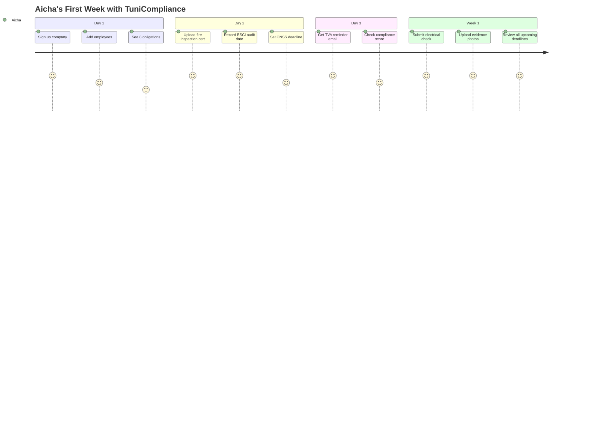

# 🎯 MVP Scope Definition
## Phase 1 Feature Prioritization for Tunisian Compliance SaaS

> [!IMPORTANT]
> This document defines **exactly what we build in MVP** to ship a valuable product in 8-10 weeks instead of attempting all 120+ regulatory obligations at once.

---

## 1. MVP Success Criteria

**Viable Product = Helps a textile SME pass a BSCI audit and avoid fiscal/social penalties**

### Core Value Proposition
> Enable a 100-employee textile factory to:
> - Track their 3 most critical audits (BSCI, Fire Safety, Electrical)
> - Never miss CNSS/TVA deadlines
> - Store evidence for inspectors
> - Know their compliance risk level at a glance

---

## 2. Out of Scope (MVP)

We are **NOT** building in Phase 1:
- ❌ All 120 regulatory obligations
- ❌ AI-powered compliance advisor
- ❌ Mobile native apps (PWA is enough)
- ❌ Advanced analytics/reporting
- ❌ Integration with government portals
- ❌ Workflow approvals
- ❌ Multi-company groups (holding structure)
- ❌ Custom obligation creation

---

## 3. Phase 1 Obligations (Prioritized)

### 🔥 Tier 1: MUST HAVE (Core MVP)

| # | Obligation | Category | Why Critical | Frequency |
|---|------------|----------|--------------|-----------|
| 1 | **BSCI Audit** | Brand Compliance | Contractual requirement, factory closure risk | 2 years |
| 2 | **Fire Safety Inspection** | HSE | Post-Rana Plaza, zero tolerance | Annual |
| 3 | **Electrical Installation Check** | HSE | Accident prevention, insurance requirement | Annual |
| 4 | **CNSS Declaration** | Social | Penalties 10k+ TND, employee protection | Quarterly |
| 5 | **TVA Declaration** | Fiscal | Legal requirement, business continuity | Monthly |
| 6 | **Médecine du Travail** | HSE | Labor law Art. 152, worker health | Annual |
| 7 | **Hazardous Waste Tracking** | Environmental | ANPE fines, environmental liability | Continuous |
| 8 | **Work Contracts Registration** | Labor | Inspection du Travail compliance | Per hire |

**Total: 8 obligations covering 70% of SME compliance risk**

---

### ⚠️ Tier 2: SHOULD HAVE (Quick Wins)

| # | Obligation | Category | Rationale |
|---|------------|----------|-----------|
| 9 | Disney FAMA Audit | Brand | Major Tunisian client |
| 10 | IRPP/IS Annual Tax | Fiscal | Once per year, less urgent |
| 11 | SST Training (First Aid) | HSE | 2-year cycle, trainable |
| 12 | ISO 9001 Certification | Quality | Competitive advantage |

**Implement if time permits in Phase 1**

---

### 🔵 Tier 3: NICE TO HAVE (Phase 2)

- Walmart Audit
- OEKO-TEX Certification  
- Wastewater Analysis (ONAS)
- Employee Delegation Elections
- All remaining 100+ obligations

---

## 4. Feature Prioritization (MoSCoW)

### 🟢 MUST Have (MVP Launch Blockers)

#### Core Functionality
- [x] User authentication (email/password)
- [x] Company profile creation
- [x] Multi-tenant isolation (companyId filtering)
- [x] Dashboard with compliance score
- [x] Obligation list (8 obligations from Tier 1)
- [x] Deadline calendar view
- [x] Alert notifications (in-app + email)
- [x] Evidence upload (PDF, images)
- [x] Basic check recording (Compliant/Non-compliant)
- [x] French UI with Arabic content support

#### Control & Check Features
- [x] Pre-defined controls for each obligation
- [x] Check submission form
- [x] Evidence attachment to checks
- [x] Check history per control

#### Alert System
- [x] Email alerts for 30/7/1 day warnings
- [x] Overdue deadline alerts
- [x] In-app notification center

---

### 🟡 SHOULD Have (Include if Time Permits)

- [ ] Compliance scoring with category breakdown
- [ ] Audit tracking module
- [ ] Corrective action plans (CAP)
- [ ] Export obligation list to PDF
- [ ] SMS alerts (via Twilio/Tunisia operator)
- [ ] Dark mode
- [ ] Audit report templates

---

### 🔵 COULD Have (Phase 2)

- [ ] All remaining obligations (100+)
- [ ] AI chatbot for compliance questions
- [ ] Integration with government APIs
- [ ] Advanced analytics dashboard
- [ ] Mobile native app (iOS/Android)
- [ ] API for third-party integrations
- [ ] Workflow approval system

---

### ⚫ WON'T Have (Out of Scope)

- [ ] Payroll integration
- [ ] Accounting software sync
- [ ] Document OCR/auto-extraction
- [ ] Multi-language beyond FR/AR
- [ ] Blockchain evidence verification
- [ ] Legal document generation

---

## 5. MVP User Journey

### Persona: Aicha (Responsable QHSE)



---

## 6. MVP Metrics (Success KPIs)

| Metric | Target | Measurement |
|--------|--------|-------------|
| **Onboarding time** | < 15 minutes | User completes profile + first check |
| **Daily active users** | 60% of users | Login frequency |
| **Alerts acted upon** | > 80% | Deadline completion rate after alert |
| **Evidence uploaded** | > 5 per company/month | File upload count |
| **NPS Score** | > 40 | Quarterly survey |
| **Paying customers** | 10 by Month 3 | Subscription conversions |

---

## 7. Technical Scope Limits

### Backend Limits
- **Max companies**: 100 (MVP phase)
- **Max users per company**: 20
- **File upload size**: 10 MB
- **Evidence retention**: 5 years
- **API rate limit**: 100 req/min per user

### Data Limits
- **Pre-loaded obligations**: 8 (Tier 1 only)
- **Custom obligations**: Not supported in MVP
- **Historical data import**: Manual entry only (no Excel import)

---

## 8. Development Timeline (8 Weeks)

### Week 1-2: Foundation
- [ ] Backend setup (Fastify + PostgreSQL)
- [ ] Auth module (Users + Companies)
- [ ] Frontend skeleton (React + i18n)

### Week 3-4: Core Features
- [ ] Obligation & Control modules
- [ ] Check & Evidence modules
- [ ] Deadline calculation logic
- [ ] Dashboard UI

### Week 5-6: Alerts & UX
- [ ] Alert service + email templates
- [ ] Calendar view
- [ ] Evidence upload/view
- [ ] Compliance scoring

### Week 7: Testing & Polish
- [ ] E2E tests for critical flows
- [ ] UI/UX refinements
- [ ] Performance optimization

### Week 8: Launch Prep
- [ ] Production deployment
- [ ] User onboarding flows
- [ ] Documentation

---

## 9. Phase 2 Roadmap (Post-MVP)

**After validating MVP with 10-20 customers:**

### Quarter 2 (Months 4-6)
- Add Tier 2 obligations (Disney, ISO, etc.)
- Audit module with CAP tracking
- Excel import for bulk data
- SMS notifications
- Mobile app (React Native)

### Quarter 3 (Months 7-9)
- Add 30+ more obligations
- Advanced analytics
- API for third-party integrations
- Workflow approvals
- Custom obligation builder

### Quarter 4 (Months 10-12)
- AI compliance advisor
- Government portal integration
- Multi-language (English)
- Enterprise features (SSO, etc.)

---

## 10. Risk Mitigation

| Risk | Probability | Impact | Mitigation |
|------|-------------|--------|------------|
| **Scope creep** | High | High | Strict feature freeze after Week 4 |
| **Regulatory changes** | Medium | Medium | Update obligations quarterly, not real-time |
| **Low adoption** | Medium | High | Focus on 3 pilot customers, iterate |
| **Performance issues** | Low | Medium | Load testing at Week 6 |
| **Data loss** | Low | Critical | Daily backups from Day 1 |

---

## 11. Go/No-Go Criteria

**We launch MVP if:**
- ✅ All 8 Tier 1 obligations are tracked
- ✅ Users can upload evidence
- ✅ Email alerts work reliably  
- ✅ Compliance score calculates correctly
- ✅ Zero critical security vulnerabilities
- ✅ 3+ pilot companies validate usefulness

**We delay if:**
- ❌ Core deadline tracking is buggy
- ❌ Data isolation (multi-tenancy) fails
- ❌ French/Arabic i18n incomplete

---

## 12. Competitive Positioning (MVP)

| Feature | TuniCompliance MVP | Competitors |
|---------|-------------------|-------------|
| **Tunisia-specific** | ✅ 8 critical obligations | ❌ Generic compliance |
| **Textile focus** | ✅ BSCI, Fire, Electrical | ❌ No sector focus |
| **Price** | 149 TND/month | 300-500 TND/month |
| **Setup time** | < 15 minutes | Hours of customization |
| **Language** | French + Arabic | English only |

---

## 13. User Stories (MVP Only)

### As a Responsable QHSE:
1. ✅ I want to see all upcoming compliance deadlines in one dashboard
2. ✅ I want email reminders 7 days before CNSS deadline
3. ✅ I want to upload our BSCI audit report and set expiry date
4. ✅ I want to record that fire extinguisher check passed
5. ✅ I want to know our overall compliance score

### As a Directeur Général:
1. ✅ I want to see if we're at risk (Red/Yellow/Green status)
2. ✅ I want to download evidence for auditor visit
3. ✅ I want to add a new user (compliance officer)

### As a Compliance Officer:
1. ✅ I want to mark CNSS deadline as completed
2. ✅ I want to see what's overdue
3. ✅ I want to attach photos of emergency exit signs

---

## 14. Acceptance Criteria

**MVP is "Done" when:**

```gherkin
Scenario: New company onboards successfully
  Given I am a new user at a textile factory
  When I create a company profile with Tax ID and CNSS
  And I see 8 pre-loaded obligations
  Then I can add my first deadline (CNSS due 15 Feb)
  And upload evidence (contract PDF)
  And receive email alert 7 days before
  And see my compliance score update to 12.5% (1/8 complete)
```

---

## 15. Communication Plan

### To Stakeholders
**Weekly Progress Email**:
- ✅ Completed: User auth + company module
- 🔄 In Progress: Obligation tracking
- 🔜 Next Week: Evidence upload

### To Pilot Customers
**Bi-weekly Demo**:
- Show working features
- Gather feedback
- Adjust priorities if needed

---

**Document Version**: 1.0  
**Last Updated**: 2026-01-27  
**Next Review**: Week 4 (scope validation)  
**Owner**: Product Team
