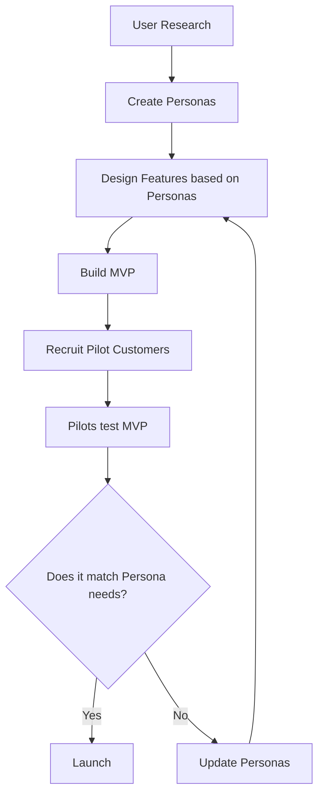

# 🎯 Personas vs Pilot Customers - Explained
## Practical Guide for TuniCompliance

> [!NOTE]
> **TL;DR**: 
> - **Personas** = Fictional characters representing user types (design tool)
> - **Pilot Customers** = Real companies testing your MVP (validation tool)

---

## Part 1: User Personas - What & Why

### What is a Persona?

A **persona** is a **fictional but realistic character** that represents a type of user.

Think of it as a **composite character** created from research about real users.

### Real Example: Aicha (QHSE Officer)

```
👤 Aicha, 35 years old
📍 Works at SportWear Tunisia SARL (150 employees)
🎓 Engineer from ENIT
💼 Responsable QHSE
📧 Fluent French, conversational Arabic
😫 Pain: "I have 10 Excel files for different audits and can't find documents"
🎯 Goal: "Never miss a CNSS deadline and pass BSCI audit without stress"
💻 Tech: Intermediate - uses Excel daily, willing to learn new tools
```

**This is NOT a real person** - it's a character that represents the 60-70% of your users who are QHSE officers in Tunisian textile factories.

---

### How Do You Use Personas?

#### ❌ **WRONG Way** (Ignoring Personas)

Developer builds feature:
```
"Let's add a compliance dashboard with 20 metrics"
```

**Result**: Aicha is overwhelmed, doesn't use it.

---

#### ✅ **RIGHT Way** (Using Personas)

Developer asks:
```
"What does Aicha (QHSE officer) REALLY need?"

Looking at persona:
- Pain: Can't find documents
- Goal: Never miss deadlines
- Tech skill: Intermediate

Decision:
"Dashboard should show:
1. Next 3 upcoming deadlines (BIG and CLEAR)
2. Quick upload button for evidence
3. Simple Green/Yellow/Red status

NOT 20 metrics - too complex for her!"
```

**Result**: Aicha loves it, uses it daily.

---

### Practical Application of Personas

#### Use Case 1: Designing the Dashboard

**Question**: What should be on the homepage?

**Without persona**: "Let's put everything! Graphs, tables, charts..."

**With Aicha persona**:
- She's busy (60% of time on admin tasks)
- She needs quick answers: "Are we compliant?"
- She panics before audits

**Dashboard design**:
```
┌─────────────────────────────────┐
│  Compliance Score: 78% 🟡       │  ← BIG number (Mohamed wants this)
│                                 │
│  Upcoming Deadlines:            │
│  🔴 CNSS - Due in 3 days        │  ← Aicha's #1 need
│  🟡 Fire Inspection - 15 days   │
│  🟢 BSCI Renewal - 45 days      │
│                                 │
│  [Upload Evidence] Button       │  ← Quick access
└─────────────────────────────────┘
```

---

#### Use Case 2: Choosing Features

**Question**: Should we add "custom compliance reports" in MVP?

**Check against personas**:
- **Aicha** (Primary): "I just need to know what's due. Don't care about reports."
- **Mohamed** (CEO): "Give me a PDF for investors - but not critical for MVP."

**Decision**: ❌ **No custom reports in MVP** - defer to Phase 2.

---

#### Use Case 3: Writing Error Messages

**Wrong** (Technical):
```
Error: Validation failed for field 'taxId'. 
Expected pattern: /^\d{7}\/[A-Z]\/[A-Z]\/[A-Z]\/\d{3}$/
```

**Right** (For Aicha):
```
❌ Le matricule fiscal doit être au format: XXXXXXX/X/A/M/XXX
Exemple: 1234567/A/M/N/001

Besoin d'aide? Consultez votre carte fiscale.
```

She understands **instantly** - no technical jargon.

---

#### Use Case 4: Onboarding Flow

**Question**: How much training does Aicha need?

**From persona**:
- Tech skill: Intermediate (not beginner, not expert)
- Time: Busy, doesn't have hours for training
- Motivation: HIGH (her job depends on compliance)

**Onboarding design**:
```
Step 1: Create account (2 min)
Step 2: Add your company (Tax ID, CNSS) (3 min)
Step 3: First deadline - CNSS (5 min)
   → Upload proof (photo of CNSS receipt)
   → Set due date
   → Done! ✅

Total: 10 minutes to value
```

**No 30-minute tutorial** - she learns by doing.

---

## Part 2: Pilot Customers - What & Why

### What is a Pilot Customer?

A **pilot customer** is a **REAL company** that uses your MVP **before public launch**.

Think of them as **beta testers with skin in the game** - they have a real compliance problem you're solving.

---

### Real Example: SportWear Tunisia SARL

```
🏭 Company: SportWear Tunisia SARL
📍 Location: Monastir
👥 Employees: 150
🏷️ Sector: Textile export (sportswear for Decathlon)
📊 Revenue: ~15M TND/year

🤝 Relationship:
- CEO Mohamed knows you personally (friend, LinkedIn, etc.)
- They have compliance pain: Failed BSCI audit last year
- They're willing to test your software FOR FREE
- In exchange: Give feedback, suggest improvements

📅 Commitment:
- Weekly 30-min demo/feedback session
- Try to use the app daily
- Report bugs and missing features
```

**This is a REAL company**, not fictional.

---

### Why You Need Pilot Customers

#### Reason 1: Validate Your Assumptions

**You assume**: "Companies want a compliance score"

**Pilot customer says**: "We don't care about the score. We just want to pass Disney audit next month. Can you help with that?"

**Learning**: Your #1 feature might be wrong. Adjust.

---

#### Reason 2: Find Bugs You Didn't Test

**You test**: Create company with Tax ID `1234567/A/M/N/001` ✅ Works!

**Pilot customer tries**: Tax ID `0000123/B/P/M/999` ❌ Breaks!

**Learning**: Your validation regex was wrong. Fix before launch.

---

#### Reason 3: Get Real Testimonials

**After MVP**:
```
"Before TuniCompliance, we missed CNSS deadlines twice and paid 
5,000 TND in penalties. Now we get alerts 7 days before. 
This saved us money!"
- Mohamed, CEO SportWear Tunisia SARL
```

**Use this** on your website → new customers trust you.

---

#### Reason 4: Understand Real Workflows

**You thought**: "Users upload evidence immediately after completing a check"

**Pilot observes**: "Aicha does the fire drill on Monday, but uploads photos on Friday when she has time"

**Learning**: Add **"Save draft"** feature - don't force immediate upload.

---

### How to Find Pilot Customers?

#### Option 1: Personal Network (Easiest)

- Family member runs a factory?
- Friend works at textile company?
- LinkedIn connections in Tunisia manufacturing?

**Ask**: "Can I build you free compliance software in exchange for weekly feedback?"

---

#### Option 2: Industry Events

- Textile trade shows (Tunisia)
- UTICA (employers' union) events
- Chamber of Commerce meetings

**Pitch**: "I'm building compliance software for Tunisian SMEs. Looking for 3 factories to test it. Free for 3 months."

---

#### Option 3: Cold Outreach

**Email template**:
```
Subject: Compliance software for textile factories - Free pilot

Bonjour [Name],

I'm building TuniCompliance, a tool to help Tunisian textile 
factories track BSCI audits, CNSS deadlines, and fire inspections.

Would you be interested in a FREE 3-month pilot program?

In exchange:
✅ Free access (worth 449 TND/month)
✅ Priority support
✅ Your feedback shapes the product

Requirements:
📅 30 min/week for demos and feedback
🐛 Report bugs you find

Interested? Let's schedule a 15-min call.

Best regards,
[Your name]
```

---

### Ideal Pilot Customer Profile

| Criteria | Why? |
|----------|------|
| **50-200 employees** | Not too small (no compliance needs), not too large (complex org) |
| **Textile/garment sector** | Your primary target |
| **Exports to EU/US** | Must pass brand audits (BSCI, Disney) |
| **Had recent compliance issue** | Motivated to fix it |
| **Tech-friendly SME** | Willing to try new software |
| **Accessible** | Near you geographically or good relationship |

---

### Pilot Timeline

```
Week 0: Recruitment
- Identify 5 candidates
- Pitch to them
- Sign up 3 pilots

Week 1-2: Onboarding
- Demo the MVP
- Help them create first company profile
- Set up first 2-3 obligations

Week 3-6: Active Use
- Weekly feedback sessions
- They use it for real compliance tasks
- You fix bugs, add small tweaks

Week 7: Decision
- Does it solve their problem?
- Would they pay for it?
- Testimonial + case study

Week 8+: Convert to Paying
- Offer discount (50% off first year)
- Or continue free if they refer 3 other companies
```

---

## Part 3: How Personas & Pilots Work Together

### The Flow



---

### Example Scenario

#### Step 1: Create Persona (Before Building)

**Aicha** needs:
- Never miss CNSS deadline
- Quick evidence upload
- Pass BSCI audit without panic

---

#### Step 2: Build MVP Features

Based on Aicha:
- Email alerts 7 days before CNSS
- Mobile-friendly file upload
- BSCI checklist

---

#### Step 3: Test with Pilot (SportWear Tunisia)

**Real Aicha** (pilot's QHSE officer) tries it:

**Feedback**:
- ✅ Email alerts work great!
- ❌ File upload from phone is buggy
- 💡 "Can I get SMS alerts too? I don't check email on weekends"

---

#### Step 4: Adjust

**Learning**:
- Fix mobile upload bug (critical)
- Add SMS alerts to Phase 2 (nice-to-have)
- Persona was 80% correct, update with "prefers SMS" note

---

## Part 4: Practical Examples for TuniCompliance

### Persona in Action: Choosing Alert Timing

**Question**: When to send deadline alerts?

**Check persona**:
- **Aicha**: Works Monday-Friday, 8 AM - 5 PM
- Checks email: Morning (9 AM) and after lunch (2 PM)
- CNSS due: 15th of each month

**Decision**:
```
Send alerts:
- 30 days before: Email on 15th of previous month at 9 AM
- 7 days before: Email on 8th at 9 AM
- 1 day before: Email + SMS on 14th at 9 AM

NOT at midnight - she's sleeping!
```

---

### Pilot in Action: Discovering Missing Feature

**Pilot**: "We have 2 factories - can we manage both in one account?"

**You realize**: MVP only supports 1 company per account!

**Options**:
1. Build multi-company feature (2 weeks)
2. Tell pilot to create 2 accounts (workaround)

**Decision**: Workaround for now, add to Phase 2 roadmap.

**Learning**: Validate with other pilots - do they need this too?

---

## Part 5: How Many Personas & Pilots?

### Personas

**For TuniCompliance:**
- **3-5 personas** is ideal
- You have **5 already** ✅:
  1. Aicha (QHSE) - Primary
  2. Mohamed (CEO) - Secondary
  3. Fatma (HR) - Tertiary
  4. Karim (Auditor) - External
  5. Salma (Employee) - Future

**Focus on top 2** for MVP (Aicha + Mohamed).

---

### Pilot Customers

**Ideal**: **3-5 pilot companies**

**Why 3 minimum?**
- 1 pilot: Could be an outlier
- 2 pilots: Could both be outliers
- 3 pilots: Patterns emerge ("All 3 want SMS alerts!")

**Why not 10?**
- Too much feedback to manage
- Harder to schedule demos
- Diminishing returns

---

## Part 6: Common Mistakes

### ❌ Mistake 1: Treating Personas as Real People

**Wrong**:
```
"Let me interview Aicha"
```

**Right**:
```
"Let me interview 5 QHSE officers in Tunisian textile factories 
to validate/update my Aicha persona"
```

---

### ❌ Mistake 2: Treating Pilots as Free QA

**Wrong**:
```
"My pilot found 20 bugs. They're my free testers!"
```

**Right**:
```
"My pilot found 20 bugs AND told me the BSCI checklist feature 
is what they value most. This guides my roadmap."
```

Pilots give **strategic feedback**, not just bug reports.

---

### ❌ Mistake 3: Too Many Personas

**Wrong**: 20 personas for every possible user type

**Right**: 3-5 personas representing 80%+ of users

Focus beats completeness.

---

### ❌ Mistake 4: Pilot Without Commitment

**Wrong**:
```
"Hey, try my app if you have time"
```

**Right**:
```
"Can you commit to:
- Using the app 10 min/day for 6 weeks
- Weekly 30-min feedback call
- Reporting bugs within 24h?

In exchange: Free forever + we'll build features you need"
```

Mutual commitment = better results.

---

## Part 7: Your Next Steps

### For Personas (Already Done ✅)

You have solid personas in `USER_PERSONAS.md`. Use them to:

1. **Before building any feature**, ask:
   - Does Aicha (primary) need this?
   - Does Mohamed (secondary) care?
   - Or is this "nice-to-have"?

2. **When writing UI copy**, ask:
   - Would Aicha understand this?
   - Is this in French (her work language)?

3. **When prioritizing bugs**, ask:
   - Does this block Aicha's main workflow?
   - Or is it edge case?

---

### For Pilot Customers (To Do ⏳)

**Action plan**:

#### Week 0 (This Week):
- [ ] List 10 potential pilot companies
  - Friend's factory?
  - LinkedIn connections?
  - Former colleagues?

#### Week 1:
- [ ] Reach out to 10, aim for 5 interested
- [ ] Pitch: Free software, need feedback

#### Week 2:
- [ ] Select best 3 pilots
- [ ] Sign simple agreement (1-page):
  ```
  Pilot Agreement:
  - Free access for 3 months
  - Weekly 30-min call
  - Honest feedback required
  - Can quit anytime
  ```

#### Week 3-8:
- [ ] Onboard pilots as you build
- [ ] Gather feedback
- [ ] Iterate

---

## Summary Table

| Aspect | Personas | Pilot Customers |
|--------|----------|-----------------|
| **What?** | Fictional characters | Real companies |
| **When?** | Before building | During building |
| **Purpose** | Guide design decisions | Validate those decisions |
| **Example** | "Aicha, 35, QHSE officer" | "SportWear Tunisia SARL" |
| **How many?** | 3-5 | 3-5 |
| **Cost** | Free (research time) | Free (but time commitment) |
| **Output** | Design choices (features, UI) | Bug reports, testimonials, learning |

---

## 🎯 Final Analogy

**Building software without personas & pilots is like:**

❌ **Cooking a meal for guests you've never met**
- You don't know if they're vegetarian
- You don't know if they like spicy food
- You just guess and hope

✅ **Using personas & pilots:**
- **Persona (Aicha)**: "Most Tunisian QHSE officers like simple, clear dashboards (not spicy complexity)"
- **Pilot (SportWear Tunisia)**: "Aicha tested your dish and said 'needs more SMS alerts, less email'"

**Result**: You cook exactly what your customers want.

---

**Questions?**
- 💡 "How do I write my first pilot agreement?"
- 💡 "What if I can't find pilot customers?"
- 💡 "Should I pay pilots?"

Let me know!
