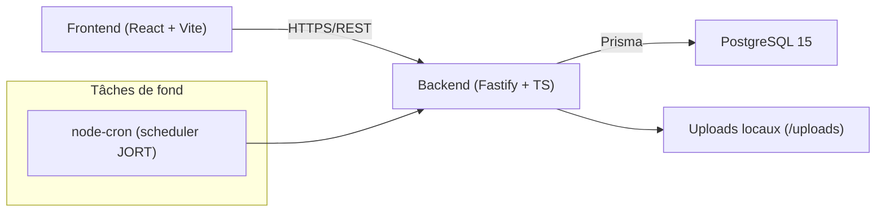
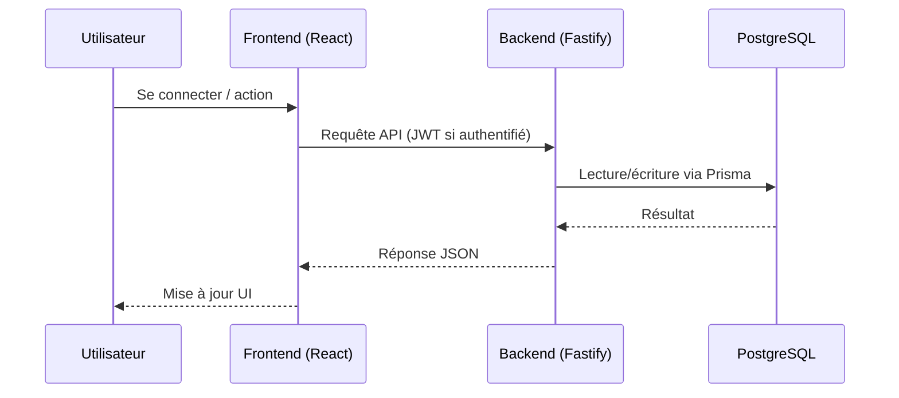

# TuniCompliance — Vue d'ensemble technique (Une page)

Dernière mise à jour : 2026-03-26

## Objectif
Ce document résume la stack actuelle, l’architecture et les dépendances principales du repo. Il reflète le code et la configuration à la date ci‑dessus.

## Stack
Backend
- Runtime : Node.js (Docker utilise `node:20-alpine`)
- Framework : Fastify 5
- Langage : TypeScript
- ORM : Prisma
- DB : PostgreSQL 15
- Auth : JWT
- Validation : Zod
- Logs : Pino

Frontend
- React 19 + TypeScript
- Build : Vite
- Routage : React Router
- i18n : i18next + react-i18next

Infra/Dev
- Docker + docker-compose
- Nginx (sert le frontend buildé)
- Vitest (tests backend)
- ESLint (lint frontend)

## Architecture (Actuelle)
Style
- Monolithe modulaire côté backend, organisé par domaines.
- Chaque module possède ses routes, services et accès aux données.

Structure backend
- `backend/src/server.ts` configure Fastify, l’auth, l’upload de fichiers et toutes les routes des modules.
- Les modules de domaine se trouvent dans `backend/src/modules/*`.
- Le schéma Prisma et les seeds sont dans `backend/prisma`.
- Les fichiers uploadés sont servis depuis `backend/src/uploads` via Fastify static.

Structure frontend
- App Vite sous `frontend/`, buildée en assets statiques.
- Nginx sert `frontend/dist` dans Docker.

Tâches de fond
- Le scheduler JORT utilise `node-cron` (voir `backend/src/modules/jort/jort.scheduler.ts`).

Déploiement (local/Docker)
- `docker-compose.yml` démarre Postgres, l’API backend et le frontend (Nginx).

## Schéma système (Mermaid)

## Flux de requête (Mermaid)

## Modules clés (Backend)
- `companies`, `users`, `obligations`, `controls`, `checks`, `evidence`
- `deadlines`, `alerts`, `scoring`, `audit`, `reports`, `action-items`, `jort`

## Dépendances (Résumé)
Backend runtime (sélection)
- Fastify : `fastify`, `@fastify/cors`, `@fastify/jwt`, `@fastify/multipart`, `@fastify/static`
- Prisma : `prisma`, `@prisma/client`
- Validation/Auth : `zod`, `bcrypt`
- Jobs/Email/Fichiers : `node-cron`, `nodemailer`, `pdfkit`
- HTTP/Parsing : `axios`, `axios-cookiejar-support`, `tough-cookie`, `fast-xml-parser`
- Logs/Config : `pino`, `dotenv`

Backend dev/test (sélection)
- `typescript`, `tsx`, `nodemon`, `vitest`, `@types/*`

Frontend runtime
- `react`, `react-dom`, `react-router-dom`
- `i18next`, `react-i18next`
- `recharts`, `lucide-react`, `react-webcam`, `exif-js`

Frontend dev
- `vite`, `@vitejs/plugin-react`, `typescript`
- `eslint` + plugins, `@types/react`, `@types/react-dom`

## Notes doc vs code
- Le README racine mentionne Node 18+, mais les Dockerfiles utilisent Node 20.
- Le guide d’architecture mentionne React 18 et Prisma 7 ; les dépendances actuelles sont React 19 et Prisma 6.19.1.
