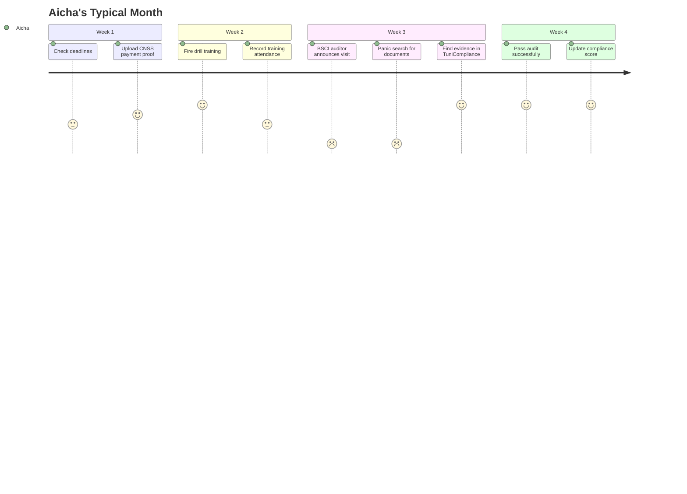
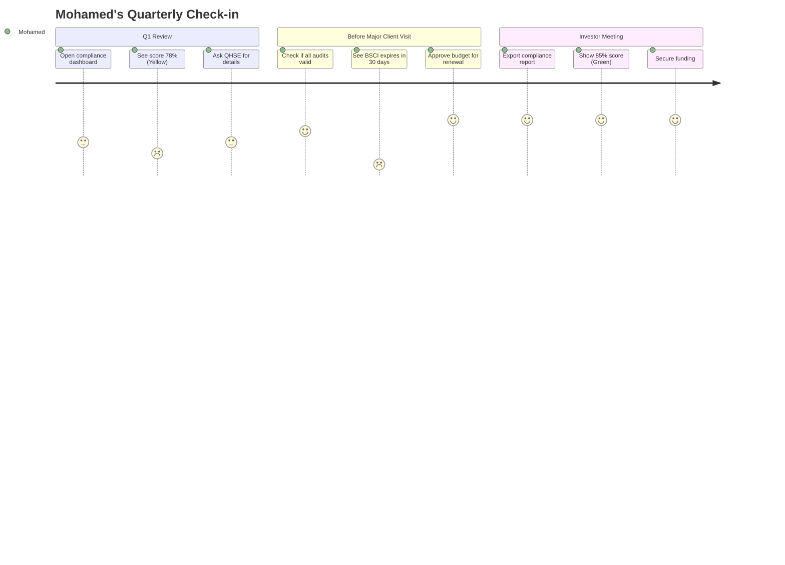
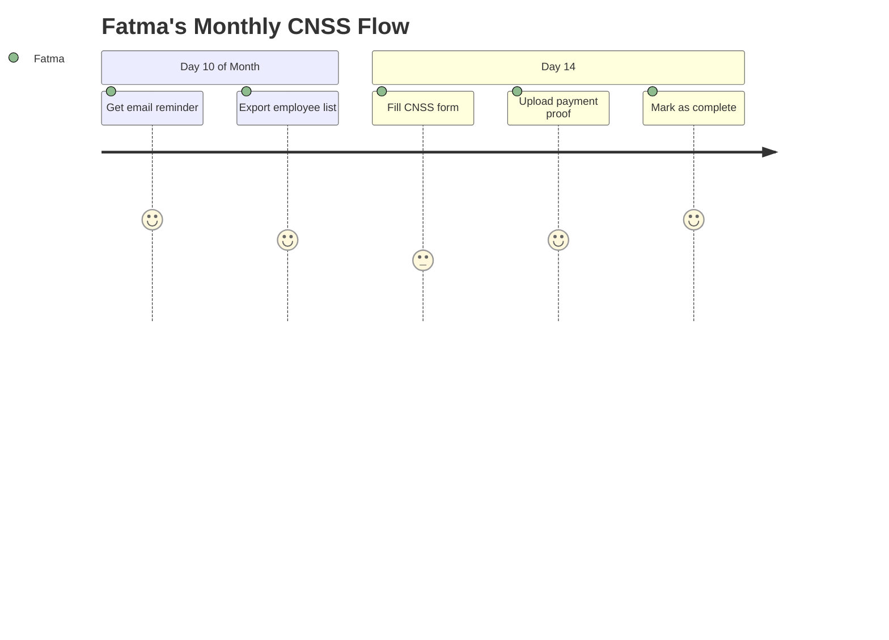
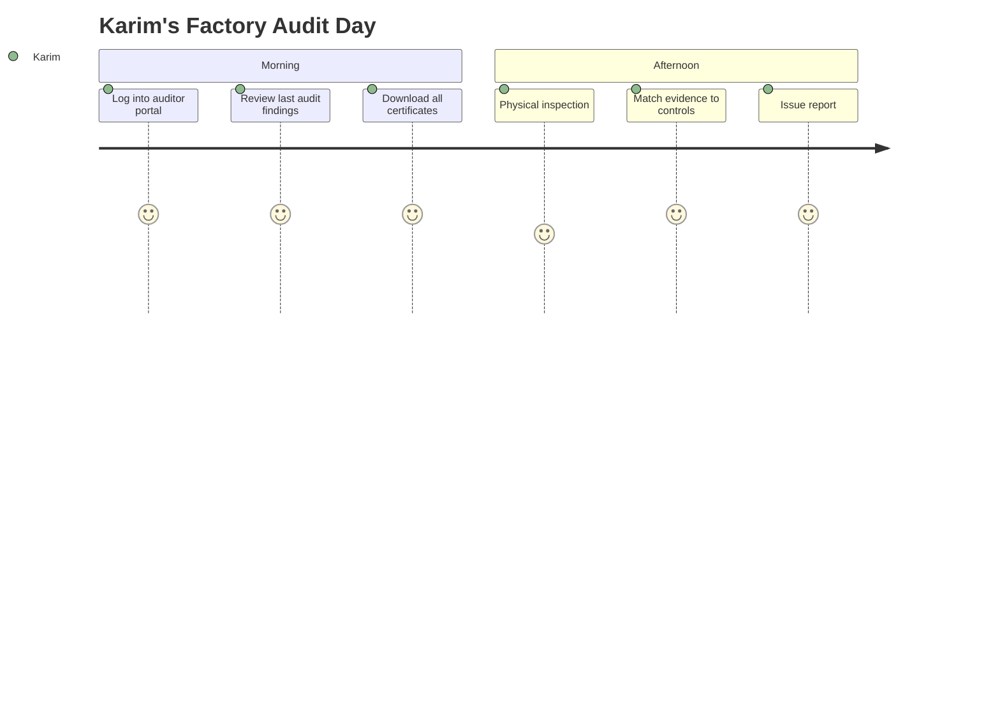

# 👥 User Personas
## Target Users for Tunisian Compliance SaaS

> [!NOTE]
> These personas represent real stakeholders in Tunisian textile/industrial SMEs. Use them to guide UI/UX decisions, feature prioritization, and communication strategy.

---

## Persona 1: Aicha - Responsable QHSE/Compliance Officer

### Demographics
- **Age**: 32-38 years
- **Education**: Engineering degree (Industrial or Chemical) from ENIT or INSAT
- **Experience**: 5-8 years in manufacturing
- **Language**: Fluent French, conversational Arabic
- **Location**: Greater Tunis / Sahel region (Monastir, Sousse)

### Role & Responsibilities
- **Title**: Responsable QHSE (Qualité, Hygiène, Sécurité, Environnement)
- **Reports to**: Directeur Général or Production Manager
- **Team size**: 0-2 subordinates (in SME)
- **Salary range**: 2,500-3,500 TND/month

#### Daily Tasks
- ✅ Coordinate external audits (BSCI, Disney, Walmart)
- ✅ Track safety inspections (fire, electrical, machinery)
- ✅ Manage hazardous waste collection
- ✅ Prepare documentation for inspectors
- ✅ Train employees on safety procedures
- ✅ Report compliance status to management

### Pain Points

| Pain | Impact | Current Workaround |
|------|--------|-------------------|
| **Excel hell** | High | 10+ separate Excel files for different audits |
| **Missed deadlines** | Critical | Manual calendar reminders, often forgotten |
| **Scattered evidence** | High | Files on desktop, email, USB drives |
| **Audit panic** | Critical | Last-minute scrambling when auditor announces visit |
| **No visibility** | Medium | Management asks "Are we compliant?" - no clear answer |

### Goals & Motivations
1. 🎯 **Never miss a critical deadline** (CNSS, fire inspection)
2. 🎯 **Pass brand audits** without last-minute stress
3. 🎯 **Prove competence** to management with clear metrics
4. 🎯 **Reduce time** spent on admin (currently 60% of job)
5. 🎯 **Avoid fines** that could cost her job

### Technology Profile
- **Devices**: Windows laptop, Android smartphone
- **Software Skills**: Expert in Excel, basic Word, email
- **Tech Comfort**: Intermediate - willing to learn new tools if they save time
- **Preferred Communication**: Email, WhatsApp for urgent

### Quotes
> "I have a BSCI audit next month and I can't find the last electrical inspection report. It's somewhere in my emails from 2024..."

> "My boss asks me 'Are we compliant?' and I don't even know where to start answering."

> "I spend more time looking for documents than actually improving safety."

### What Aicha Needs from TuniCompliance
- ✅ **Single source of truth** - All compliance in one place
- ✅ **Proactive alerts** - Email reminders before deadlines
- ✅ **Evidence vault** - Never lose a certificate again
- ✅ **Quick status** - Answer "Are we compliant?" in 5 seconds
- ✅ **Audit readiness** - Generate report for inspector in 2 clicks

### User Journey

### Success Metrics (How we know she's happy)
- ⏱️ Spends < 30 min/day on the platform
- 📧 Acts on 80%+ of alert emails
- 📁 Uploads evidence within 24h of completion
- 😊 NPS Score > 8

---

## Persona 2: Mohamed - Directeur Général (CEO/Owner)

### Demographics
- **Age**: 45-60 years
- **Education**: Business degree or engineering, some self-taught
- **Experience**: 15-30 years, built company from scratch or inherited
- **Language**: Fluent Arabic and French
- **Location**: Tunis, Sahel, or Sfax

### Role & Responsibilities
- **Title**: Directeur Général or Propriétaire-Gérant
- **Company size**: 50-300 employees, 10-50M TND revenue
- **Industry**: Textile/garment manufacturing (80%), other industries (20%)

#### Daily Focus
- 💼 Client relationships (European buyers)
- 💼 Financial oversight (cashflow, margins)
- 💼 Strategic decisions (new equipment, markets)
- 💼 Government relations (FIPA, CNSS)
- 💼 Crisis management (late deliveries, quality issues)

### Pain Points

| Pain | Impact | Current Workaround |
|------|--------|-------------------|
| **Compliance is invisible** | High | Trusts QHSE officer, hopes for best |
| **Audit failures** | Critical | Lost contracts worth millions |
| **Investor pressure** | Medium | Can't quantify ESG compliance for investors |
| **Fines & penalties** | High | Reactive - pay fine, then fix |
| **Reputation risk** | Critical | Fear of ending up on banned supplier list |

### Goals & Motivations
1. 🎯 **Protect business** - Avoid contract loss due to failed audits
2. 🎯 **Know the risk** - Simple Red/Yellow/Green status
3. 🎯 **Delegation** - Trust team, but verify
4. 🎯 **Investor readiness** - Show ESG compliance for funding
5. 🎯 **Competitive edge** - Win more contracts with excellent compliance

### Technology Profile
- **Devices**: Laptop, iPhone/Samsung flagship
- **Software Skills**: Basic - uses email, WhatsApp, simple dashboards
- **Tech Comfort**: Low - delegates to tech-savvy staff
- **Preferred Communication**: Phone calls, WhatsApp, in-person meetings

### Quotes
> "A buyer just asked about our BSCI score. I don't even know if we have one."

> "We failed a Disney audit last year and lost a 2M euro contract. Never again."

> "I need to know: are we compliant or not? I don't have time for details."

### What Mohamed Needs from TuniCompliance
- ✅ **Executive dashboard** - Compliance score in big numbers
- ✅ **Risk alerts** - "Critical: Fire inspection expires in 3 days"
- ✅ **Investor reports** - PDF export for due diligence
- ✅ **Delegation tools** - Assign tasks to QHSE officer
- ✅ **Mobile access** - Check status from phone during client meeting

### User Journey

### Success Metrics
- 📊 Logs in weekly (passive monitoring)
- 🚨 Responds to critical alerts within 24h
- 📄 Downloads reports monthly for stakeholders
- 💰 Sees ROI (avoided 1 fine = yearly subscription cost)

---

## Persona 3: Fatma - Assistante Administrative / HR Coordinator

### Demographics
- **Age**: 28-45 years
- **Education**: High school + secretarial training or Bac+2 in management
- **Experience**: 5-15 years in administrative roles
- **Language**: Fluent Arabic and French
- **Location**: Works on-site at factory

### Role & Responsibilities
- **Title**: Assistante de Direction or Responsable RH
- **Reports to**: Directeur Général
- **Tasks**: Employee contracts, CNSS declarations, administrative documents

#### Daily Tasks
- 📝 Prepare monthly CNSS declarations
- 📝 File employee work contracts with Inspection du Travail
- 📝 Track employee medical visits
- 📝 Handle social security paperwork
- 📝 Maintain employee registry

### Pain Points

| Pain | Impact | Workaround |
|------|--------|------------|
| **Manual data entry** | High | Re-type employee data into 5+ government forms |
| **Deadline stress** | Medium | CNSS due 15th of month - always rushed |
| **Document storage** | Medium | Paper files in cabinets, some scanned |
| **Error-prone** | Medium | Typos in CNSS numbers cause rejections |

### Goals
1. 🎯 **Never miss CNSS deadline** (avoids penalties)
2. 🎯 **Reduce data re-entry**
3. 🎯 **Quick document access** for inspectors

### What Fatma Needs
- ✅ **CNSS reminder** - Alert 5 days before deadline
- ✅ **Employee database** - Store contracts, medical certs
- ✅ **Pre-filled forms** - Auto-populate from employee data
- ✅ **Simple UI** - No technical jargon

### User Journey

### Success Metrics
- ⏰ CNSS submitted on-time 100%
- 📂 All employee docs digitized
- ⌨️ 50% reduction in data re-entry

---

## Persona 4: Karim - External Auditor (Brand/Certification)

### Demographics
- **Age**: 30-50 years
- **Education**: Engineering or quality management degree
- **Employer**: SGS, Bureau Veritas, Intertek
- **Language**: French, English, Arabic

### Role & Responsibilities
- **Title**: Lead Auditor or Inspector
- **Audits**: BSCI, ISO 9001, Fire Safety, Electrical
- **Frequency**: 10-15 factory visits per month

#### Audit Process
1. 📋 Review documentation (certificates, training records)
2. 🏭 Physical inspection (fire extinguishers, exits, equipment)
3. 👥 Interview employees and management
4. 📝 Write audit report with findings
5. ✅ Issue pass/fail decision

### Pain Points

| Pain | Impact | Current State |
|------|--------|---------------|
| **Missing documents** | High | Factory can't find last year's report |
| **Time waste** | Medium | Spend 2h searching for paperwork |
| **Incomplete evidence** | High | Training records missing signatures |

### Goals
1. 🎯 **Efficient audits** - Complete in 4h instead of full day
2. 🎯 **Complete documentation** - Evidence readily available
3. 🎯 **Clear corrective actions** - Track improvements

### What Karim Needs from TuniCompliance
- ✅ **Auditor portal** (read-only access)
- ✅ **Document vault** - Download all certificates instantly
- ✅ **Audit history** - See last 3 audits and findings
- ✅ **Evidence timestamps** - Verify authenticity

### User Journey

### Success Metrics
- ⏱️ Audit duration reduced by 30%
- 📁 95% of evidence available digitally
- ✅ Fewer "document not found" issues

---

## Persona 5: Salma - Junior Employee (Limited Access)

### Demographics
- **Age**: 22-30 years
- **Education**: High school or vocational training
- **Role**: Production operator, warehouse clerk
- **Language**: Arabic primary, some French

### Interaction with System
- **Access Level**: View-only or limited (own training records)
- **Use Case**: Check personal training certificates, medical visit dates
- **Frequency**: Monthly

### What Salma Needs
- ✅ **Arabic interface**
- ✅ **Mobile-friendly** (no computer access at work)
- ✅ **View training history**
- ✅ **Download personal certificates**

---

## Persona Summary Matrix

| Persona | Priority | Role | Key Need | Feature Focus |
|---------|----------|------|----------|---------------|
| **Aicha** | 🔴 Primary | Compliance Officer | Never miss deadlines | Alerts, Evidence, Dashboard |
| **Mohamed** | 🟠 Secondary | CEO | Know the risk level | Executive Dashboard, Reports |
| **Fatma** | 🟡 Tertiary | HR/Admin | CNSS automation | Employee module, Reminders |
| **Karim** | 🟢 External | Auditor | Fast verification | Auditor portal (Phase 2) |
| **Salma** | 🔵 Future | Employee | Self-service | Employee portal (Phase 2) |

---

## Design Implications

### UI/UX Priorities

#### For Aicha (Primary Persona)
- ✅ **Dashboard first** - Upcoming deadlines prominent
- ✅ **Quick actions** - Upload evidence in 2 clicks
- ✅ **Search** - "Find fire inspection 2024"
- ✅ **Filters** - By category, status, urgency

#### For Mohamed (Executive)
- ✅ **Executive summary page** - Big numbers, color-coded
- ✅ **Mobile optimized** - Responsive dashboard
- ✅ **Export buttons** - PDF reports prominent

#### For Fatma (HR)
- ✅ **Simple forms** - Minimal required fields
- ✅ **Pre-fill intelligent** - Reduce typing
- ✅ **Clear labels** - No technical jargon

---

## Language Strategy by Persona

| Persona | Primary Lang | Interface | Content |
|---------|-------------|-----------|---------|
| Aicha | French | French | French + Arabic regulations |
| Mohamed | French | French | French summaries |
| Fatma | Arabic | French (work standard) | Arabic helper text |
| Karim | French/English | French | French + English exports |
| Salma | Arabic | Arabic | Arabic-first |

---

## Feature Prioritization Informed by Personas

### Phase 1 (MVP)
Focus on **Aicha's daily workflow**:
1. Deadline dashboard
2. Evidence upload
3. Email alerts
4. Compliance score

### Phase 2
Add **Mohamed's executive needs**:
1. Executive dashboard
2. PDF exports
3. Risk heatmap

### Phase 3
Expand to **Fatma & others**:
1. Employee module
2. CNSS automation
3. Contract templates

---

**Document Version**: 1.0  
**Last Updated**: 2026-01-27  
**Owner**: Product Team  
**Review Frequency**: After every 10 customer interviews
